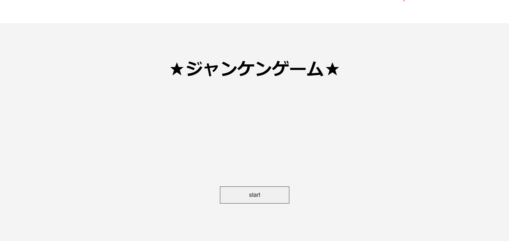
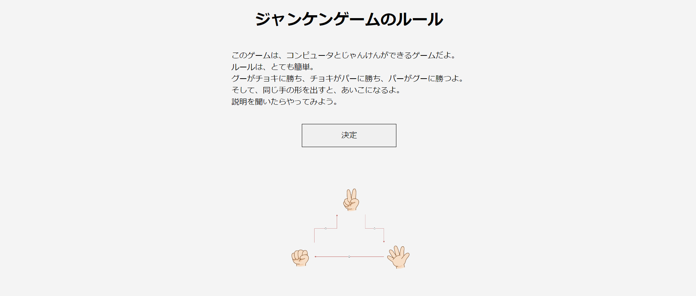
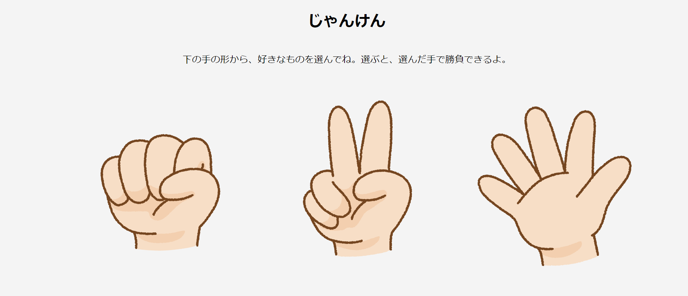
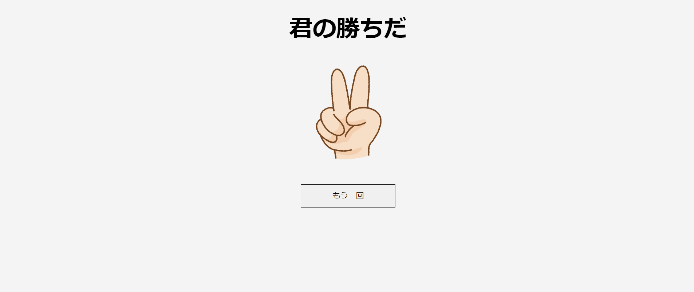

## ♠ ジャンケン

## ♠ サービスの概要

ジャンケンを行うゲームである。

## ♠ このアプリを作ったきっかけ

タイプスクリプトを使ってみて、開発してみたいと思った。
特に、自分の身近なものをコードにしてみたいと思い、ジャンケンを選んだ。

## ♠ 環境構築

- テキストエディタは、Visual Studio Code を使用する。

- node.js をインストールをする。
  - [公式サイト](https://nodejs.org/en)から、インストールできる。

## ♠ ページの説明

| 最初の画面                                   | ルール説明                                   |
| -------------------------------------------- | -------------------------------------------- |
|             |            |
| ボタンを押したら、ルール説明の画面に遷移する | ボタンを押すと、自分のターンの画面に遷移する |

| 自分のターンの画面                                                       | コンピュータのターンの画面                                                                     |
| ------------------------------------------------------------------------ | ---------------------------------------------------------------------------------------------- |
|                                |                                            |
| グーかチョキかパーのイラストを押すと、コンピュータのターンの画面に行ける | ここで、自分が選んだ手の形で勝負の結果が分かる。ボタンを押すと、自分のターンの画面に遷移する。 |
